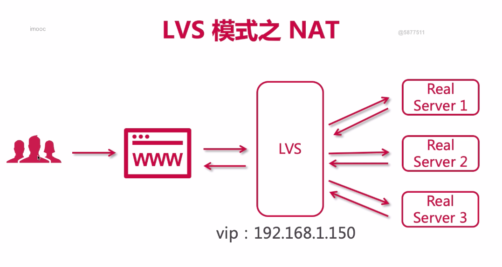
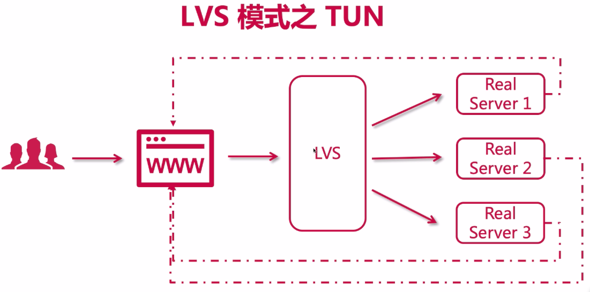
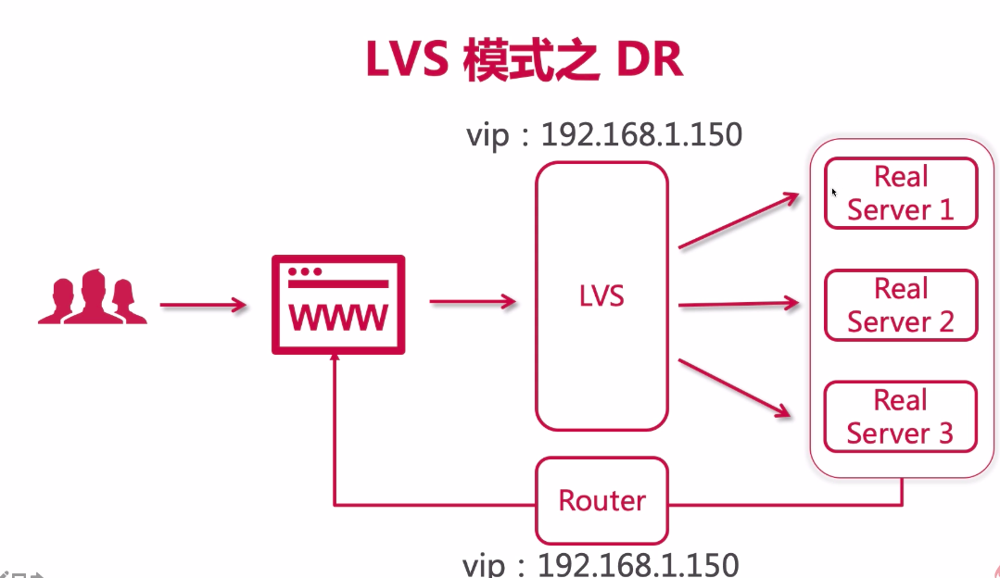
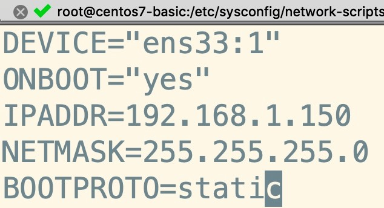
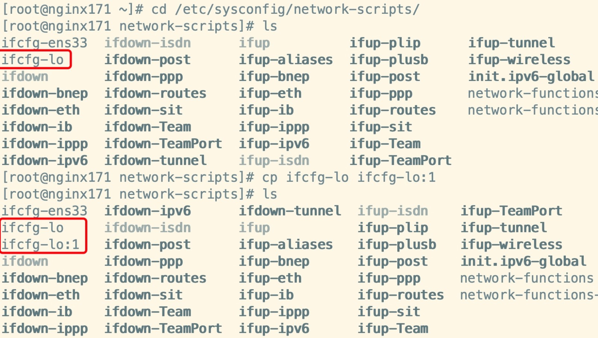
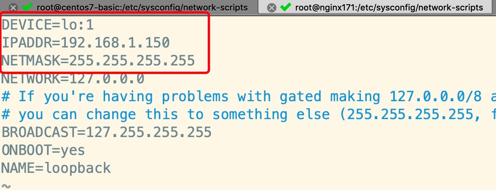
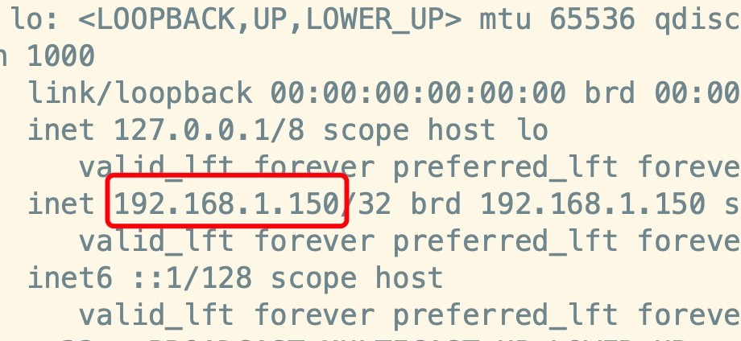
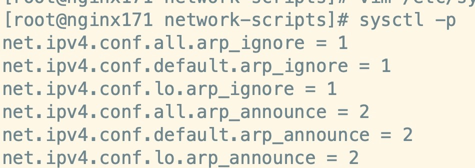
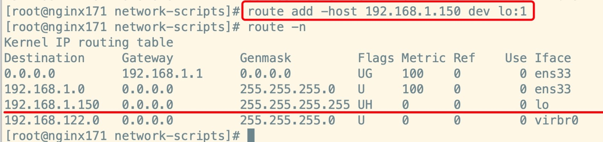

## 1. lvs负载均衡模式

- nat



- tun



- DR




## 2. 搭建lvs-DR模式

> 原理：https://www.cnblogs.com/yaboya/p/9109745.html

### 前期准备

1. 服务器与ip规划：
   - LVS - 1台
     - VIP（虚拟IP）：192.168.1.150
     - DIP（转发者IP/内网IP）：192.168.1.151
   - Nginx - 2台（RealServer）
     - RIP（真实IP/内网IP）：192.168.1.171
     - RIP（真实IP/内网IP）：192.168.1.172
2. 所有计算机节点关闭网络配置管理器，因为有可能会和网络接口冲突：

```shell
systemctl stop NetworkManager 
systemctl disable NetworkManager
```

---------------

### 创建子接口

1. 进入到网卡配置目录，找到咱们的ens33
2. 拷贝并且创建子接口：

```shell
cp ifcfg-ens33 ifcfg-ens33:1
```

3. 修改子接口配置： `vim ifcfg-ens33:1`
4. 配置参考如下：



5. 重启网络服务，或者重启linux：
6. 重启成功后，ip addr 查看一下，你会发现多了一个ip，也就是虚拟ip（vip）

-----------

### 安装ipvsadm

现如今的centos都是集成了LVS，所以`ipvs`是自带的，相当于苹果手机自带ios，我们只需要安装`ipvsadm`即可（ipvsadm是管理集群的工具，通过ipvs可以管理集群，查看集群等操作），命令如下：

```
yum install ipvsadm -y
ipvsadm -Ln
```

> 图中显示目前版本为1.2.1，此外是一个空列表，啥都没。

- 注：关于虚拟ip在云上的事儿

1. 阿里云不支持虚拟IP，需要购买他的负载均衡服务
2. 腾讯云支持虚拟IP，但是需要额外购买，一台节点最大支持10个虚拟ip

## 3. 搭建LVS-DR模式- 为两台RS配置虚拟IP

1. 进入到网卡配置目录，找到lo（本地环回接口，用户构建虚拟网络子接口），拷贝一份新的随后进行修改：



2. 修改内容如下：



3. 重启后通过ip addr 查看如下，表示ok：



## 4. 为两台RS配置arp

### ARP响应级别与通告行为 的概念

1. arp-ignore：ARP响应级别（处理请求）
   - 0：只要本机配置了ip，就能响应请求
   - 1：请求的目标地址到达对应的网络接口，才会响应请求
2. arp-announce：ARP通告行为（返回响应）
   - 0：本机上任何网络接口都向外通告，所有的网卡都能接受到通告
   - 1：尽可能避免本网卡与不匹配的目标进行通告
   - 2：只在本网卡通告

> 参考：http://blog.itpub.net/645199/viewspace-1324494/

------------

### 配置ARP

> 参考：https://www.cnblogs.com/sunsky303/p/10859356.html
>
> 参考：https://blog.csdn.net/u011857683/article/details/83795435
>
> 参考：https://blog.csdn.net/u011857683/article/details/83795279

1. 打开sysctl.conf:

```shell
vim /etc/sysctl.conf
```

2. 配置`所有网卡`、`默认网卡`以及`虚拟网卡`的arp响应级别和通告行为，分别对应：`all`，`default`，`lo`：

```
# configration for lvs
net.ipv4.conf.all.arp_ignore = 1
net.ipv4.conf.default.arp_ignore = 1
net.ipv4.conf.lo.arp_ignore = 1

net.ipv4.conf.all.arp_announce = 2
net.ipv4.conf.default.arp_announce = 2
net.ipv4.conf.lo.arp_announce = 2
```

3. 刷新配置文件：



4. 增加一个网关，用于接收数据报文，当有请求到本机后，会交给lo去处理：



5. 防止重启失效，做如下处理，用于开机自启动：

```
echo "route add -host 192.168.1.151 dev lo:1" >> /etc/rc.local
```

## 5. 搭建LVS-DR模式- 使用ipvsadm配置集群规则

1. 创建LVS节点，用户访问的集群调度者

```
ipvsadm -A -t 192.168.1.151:80 -s rr -p 5
```

- -A：添加集群
- -t：tcp协议
- ip地址：设定集群的访问ip，也就是LVS的虚拟ip
- -s：设置负载均衡的算法，rr表示轮询
- -p：设置连接持久化的时间

2. 创建2台RS真实服务器

```shell
ipvsadm -a -t 192.168.1.151:80 -r 192.168.1.60:80 -g
ipvsadm -a -t 192.168.1.151:80 -r 192.168.1.61:80 -g
```

- -a：添加真实服务器
- -t：tcp协议
- -r：真实服务器的ip地址
- -g：设定DR模式

3. 保存到规则库，否则重启失效

```shell
ipvsadm -S
```

4. 检查集群

- 查看集群列表

```shell
  ipvsadm -Ln
```

- 查看集群状态

```shell
ipvsadm -Ln --stats
```

5. 其他命令

```
# 重启ipvsadm，重启后需要重新配置
service ipvsadm restart
# 查看持久化连接
ipvsadm -Ln --persistent-conn
# 查看连接请求过期时间以及请求源ip和目标ip
ipvsadm -Lnc

# 设置tcp tcpfin udp 的过期时间（一般保持默认）
ipvsadm --set 1 1 1
# 查看过期时间
ipvsadm -Ln --timeout
# 查看当前连接
ipvsadm -Lnc
# 清空存储
ipvsadm -C
```

