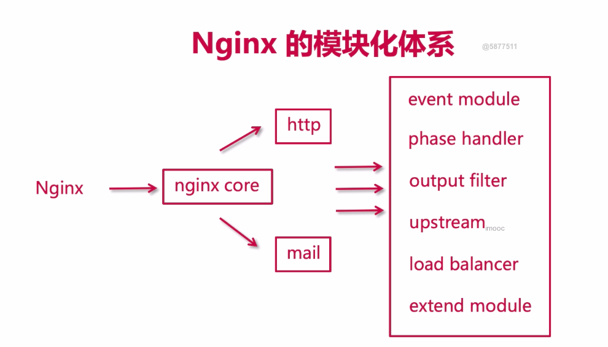
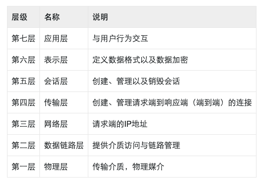
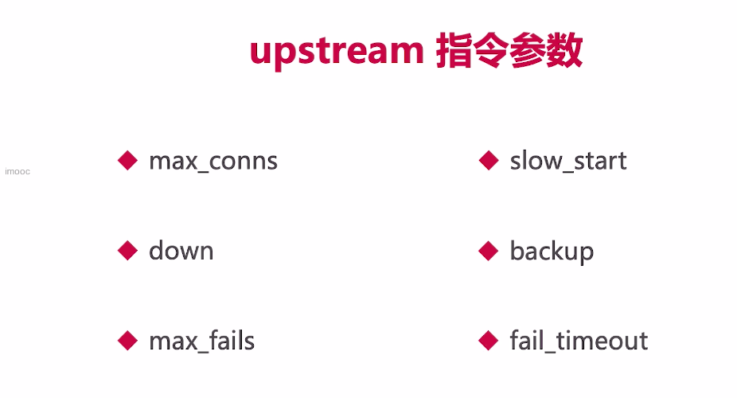

## 1. 日志切割

```shell
#!/bin/bash
LOG_PATH="/var/log/nginx/"
RECORD_TIME=$(date -d "yesterday" +%Y-%m-%d+%H:%M)
# 注意查看PID路径
PID=/var/run/nginx/nginx.pid
mv ${LOG_PATH}/access.log ${LOG_PATH}/access.${RECORD_TIME}.log
mv ${LOG_PATH}/error.log ${LOG_PATH}/error.${RECORD_TIME}.log

#向Nginx主进程发送信号，用于重新打开日志文件
kill -USR1 `cat $PID`
```

## 2. 实现定时切割日志


## 3. Root 和 alias

假如服务器路径为：/home/imooc/files/img/face.png

- root 路径完全匹配访问
  配置的时候为：

```nginx
location /imooc {
    root /home
}
```

用户访问的时候请求为：`url:port/imooc/files/img/face.png`

alias 可以为你的路径做一个别名，对用户透明
配置的时候为:

```nginx
location /hello {
    alias /home/imooc
}
```

用户访问的时候请求为：`url:port/hello/files/img/face.png`，如此相当于为目录`imooc`做一个自定义的别名。

## 4. location的匹配规则

- `空格`：默认匹配

```nginx
location / {
     root /home;
}
```

- `=`:精准匹配

```nginx
location = /imooc/img/face1.png {
    root /home;
}
```

- `~*`: 匹配正则表达式不区分大小写

```nginx
location ~* .(GIF|jpg|png|jpeg) {
    root /home;
}
```

- `~`:区分大小写

```nginx
# GIF必须大写才可以匹配到
location ~ .(GIF|jpg|png|jpeg) {
    root /home;
}
```

- `^~`：以某个字符路径开头

```nginx
location ^~ /imooc/img {
    root /home;
}
```

## 5跨域

- jsonp(实践一下)、springbootCors、nginx

```nginx
#允许跨域请求的域，*代表所有
add_header 'Access-Control-Allow-Origin' *;
#允许带上cookie请求
add_header 'Access-Control-Allow-Credentials' 'true';
#允许请求的方法，比如 GET/POST/PUT/DELETE
add_header 'Access-Control-Allow-Methods' *;
#允许请求的header
add_header 'Access-Control-Allow-Headers' *;
```

## 6 防盗链

```java
#对源站点验证
valid_referers *.imooc.com; 
#非法引入会进入下方判断
if ($invalid_referer) {
    return 404;
} 
```

## 7. nginx模块




## 8.七层负载均衡和四层负载均衡

在讲到Nginx负载均衡的时候，其实Nginx是七层负载均衡，后续我们还会涉及到LVS，是四层负载均衡，七层和四层是什么概念呢？这就必须提到网络模型。网络模型是计算机网络基础的一部分内容，一般大学计算机系都会讲到此知识点，并且会作为考点；其实在面试过程中有时候也会被问到。所以我们还是有必要来复习或学习一下这块的一些重要知识的。

网络模型就是 `OSI（Open System Interconnect）`，意思为`开放网络互联`，是由国际标准化组织(ISO)和国际电报电话咨询委员会(CCITT)共同出版的，他是一种网络互联模型，也是一种规范。

网络模型分为七层，也就是当用户发起请求到服务器接收，会历经七道工序，或者说用户利用互联网发送消息给另一个用户，也会历经七道工序。这七层可以分为如下：



以上七层每层可以与上下相邻层进行通信。每一层都是非常复杂的，我们不在这里深究，我们以举例的形式来阐述每一层是干嘛的。

- **应用层：** 这是面向用户的，最靠近用户，为了让用户和计算机交互，在计算机里会有很多软件，比如eclipse，idea，qq，nginx等，这些都是应用软件，用户可以通过这些应用软件和计算机交互，交互的过程其实就是接口的调用，应用层为用户提供了交互的接口，以此为用户提供交互服务。那么在这一层最常见的协议有：HTTP,HTTPS,FTP,SMTP,POP3等。Nginx在本层，为七层负载均衡。
  举例：我要寄一封信给远在天边的老外LiLei，我会打开快递软件下单，这个时候我是`用户`，快递软件就是`应用服务`，是建立在计算机上的，提供给用户交互的一种服务或称之为手段。
- **表示层：** 该层提供数据格式编码以及加密功能，确保`请求端`的数据能被`响应端`的应用层识别。
  举例：我写中文给LiLei，他看不懂，这个时候我就会使用翻译软件把中文翻译成英文，随后信中涉及到一些比较隐私的信息我会加密一下，这个时候翻译软件和加密器就充当了`表示层`的作用，他用于显示用户能够识别的内容。
- **会话层：** 会话可以理解为session，请求发送到接受响应的这个过程之间存在会话，会话层就充当了这一过程的管理者，从创建会话到维护会话最后销毁会话。
  举例：我每次写信给LiLei都会记录在一个小本本上，寄信时间日期，收信时间日期，这本小本本上存有每次通信记录，这个小本本就相当于是一个会话的管理者。又或者说，我们平时在打电话，首先需要拨打电话，这是`建立会话`，对方接听电话，此时正在通话（`维持并管理会话`），通话结束后`会话销毁`，那么这也是一次会话的生命周期。
- **传输层：** 该层建立端到端的连接，他提供了数据传输服务，在传输层通信会涉及到端口号，本层常见的协议为TCP、UDP，LVS就是在传输层，也就是四层负载均衡。
  举例：我和LiLei通信过程中会借助快递公司，快递公司会分配快递员取件和寄件，那么这个快递员则充当`传输层`的作用。
- **网络层：** 网络通信的时候必须要有本机IP和对方的IP，请求端和响应端都会有自己的IP的，IP就相当于你家地址门牌号，在网络上云服务器有固定的公网IP，普通计算机也有，只不过是动态IP，运营商每天会分配不同的IP给你的计算机。所以网络层也能称之为IP层，IP是互联网的基础根本。能提供IP分配的设备则为路由器或交换机。
  举例：对于拥有固定IP的云服务来说，他们都是由腾讯云、阿里云等这样的供应商提供的，他们为云服务器提供固定ip；电信、移动、联调等运营商为你的计算机动态分配ip，每天都不同；则这些供应商和运营商都是网络层。同理，快递员由物流公司分配和管理，那么物流公司就是`网络层`咯。
- **数据链路层：** 这一层会提供计算机MAC地址，通信的时候会携带，为了确保请求投递正确，所以他会验证检测MAC地址，以确保请求响应的可靠性。
  举例：快递员在投递派送的时候，他（或客服）会预先提前打电话给你，确认你家地址对不对、有没有人、货到付款有没有准备好钱等等，这个时候快递员（或客服）就充当了`数据链路层`的职责。
- **物理层：** 端到端请求响应过程中的媒介，物理介质，比如网线、中继器等等设备，都是你在端到端交互过程中不可缺少的基础设备。
  举例：快递员在投递的过程中，你写的信会历经一些交通运输工具，比如首先通过飞机运输到国外，在海关统一拿到信以后会通过汽车运输到LiLei所在城市的物流集散地，最后快递员通过三轮电频车寄到LiLei家里，这个时候，飞机、汽车、三轮电瓶车都是`物理层`的媒介。

## 9.jmeter 压力测试学习(可以先用flask试试，docker拉tomcat)


## 10. 负载均衡

```
1.轮训
2.权重
```




## 11. Max_conns

```nginx
# worker进程设置1个，便于测试观察成功的连接数
# jmeter 参数 200 0 10
# upstream 1个server 2个server测试
worker_processes  1;

upstream tomcats {
        server 192.168.1.173:8080 max_conns=2;
        server 192.168.1.174:8080 max_conns=2;
        server 192.168.1.175:8080 max_conns=2;
}
```

## 12.slow_start

***商业版，需要付费***
配置参考如下

```nginx
upstream tomcats {
        server 192.168.1.173:8080 weight=6 slow_start=60s;
#       server 192.168.1.190:8080;
        server 192.168.1.174:8080 weight=2;
        server 192.168.1.175:8080 weight=2;
}
```

##### 注意

- 该参数不能使用在`hash`和`random load balancing`中。
- 如果在 upstream 中只有一台 server，则该参数失效。

## 13 **upstream 指令参数 down、backup**

`down` 用于标记服务节点不可用：

```nginx
upstream tomcats {
        server 192.168.1.173:8080 down;
#       server 192.168.1.190:8080;
        server 192.168.1.174:8080 weight=1;
        server 192.168.1.175:8080 weight=1;
}
```

`backup`表示当前服务器节点是备用机，只有在其他的服务器都宕机以后，自己才会加入到集群中，被用户访问到：

```nginx
upstream tomcats {
        server 192.168.1.173:8080 backup;
#       server 192.168.1.190:8080;
        server 192.168.1.174:8080 weight=1;
        server 192.168.1.175:8080 weight=1;
}
注意
backup参数不能使用在hash和random load balancing中。

```

## 14 **upstream 指令参数 max_fails、fail_timeout**

`max_fails`：表示失败几次，则标记server已宕机，剔出上游服务。
`fail_timeout`：表示失败的重试时间。
假设目前设置如下：

```
max_fails=2 fail_timeout=15s 

max_fails 默认为1
fail_timeout 默认为10s
```

则代表在15秒内请求某一server失败达到2次后，则认为该server已经挂了或者宕机了，随后再过15秒，这15秒内不会有新的请求到达刚刚挂掉的节点上，而是会请求到正常运作的server，15秒后会再有新请求尝试连接挂掉的server，如果还是失败，重复上一过程，直到恢复。