## 1.快速消息

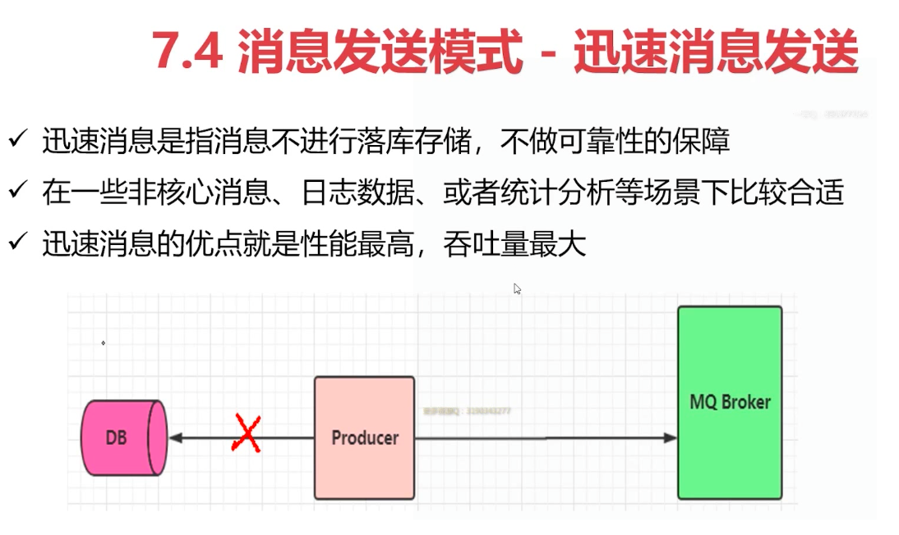

## 2. 确认消息

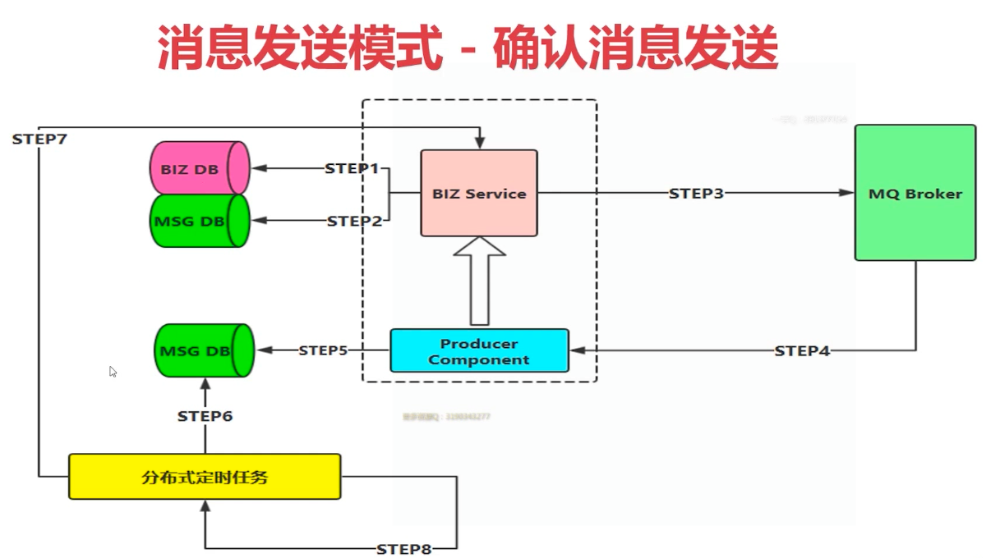

## 3. 批量消息

---

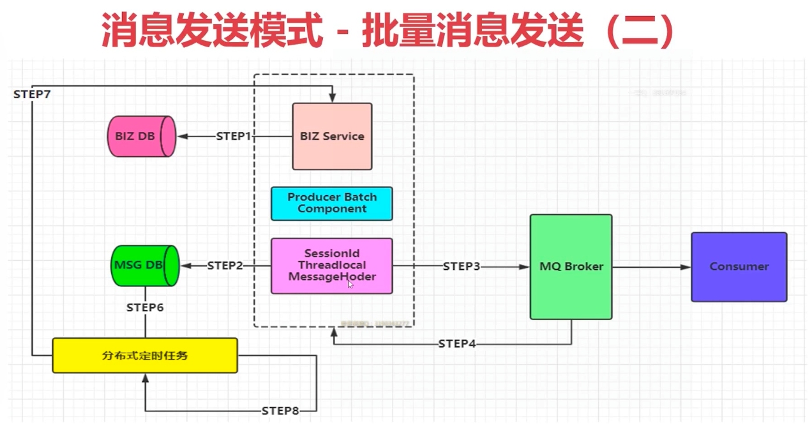

## 4. 延时消息

---

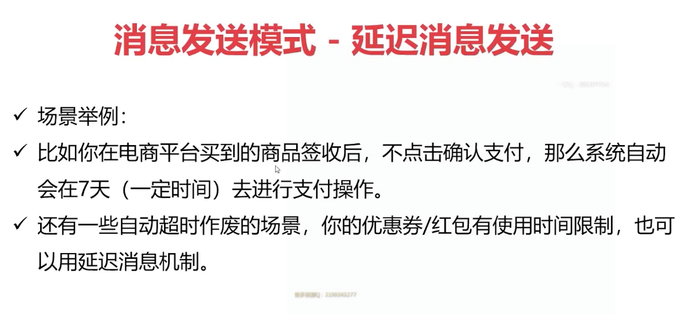

---

> 延迟队列插件安装:https://www.cnblogs.com/isunsine/p/11572457.html
>
> 延迟队列使用(python):https://blog.csdn.net/qq_26656329/article/details/77891154
>
> 延时队列使用(java):https://blog.csdn.net/Sadlay/article/details/87161615
>
> 

## 5. 顺序消息

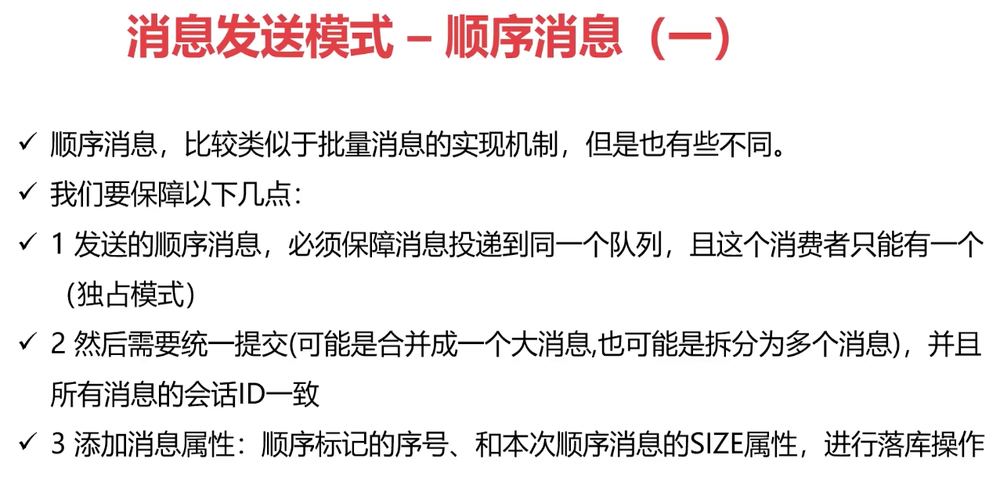

-----

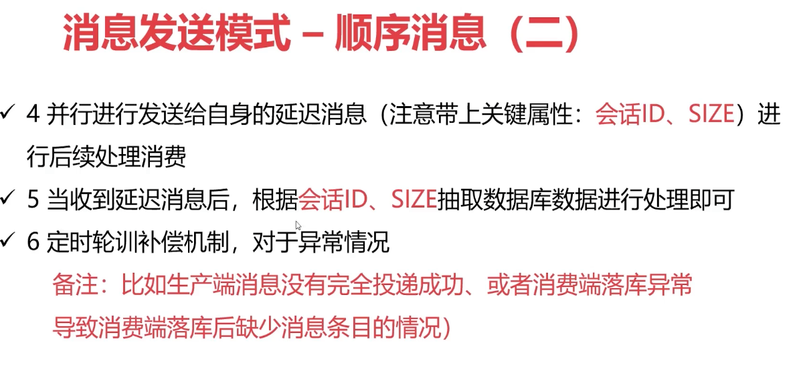

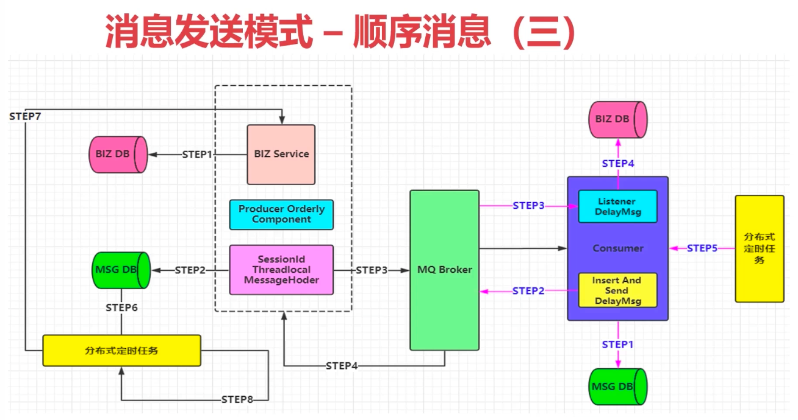

## 6. 事务消息

> 参考：https://www.cnblogs.com/vipstone/p/9350075.html

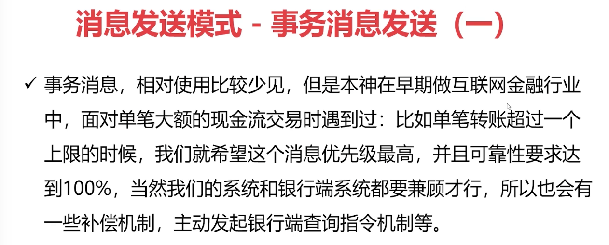

---

---

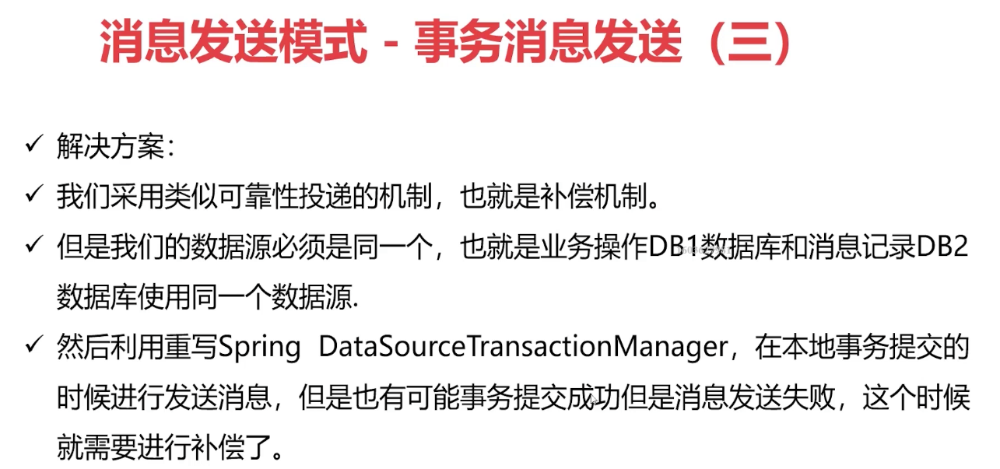

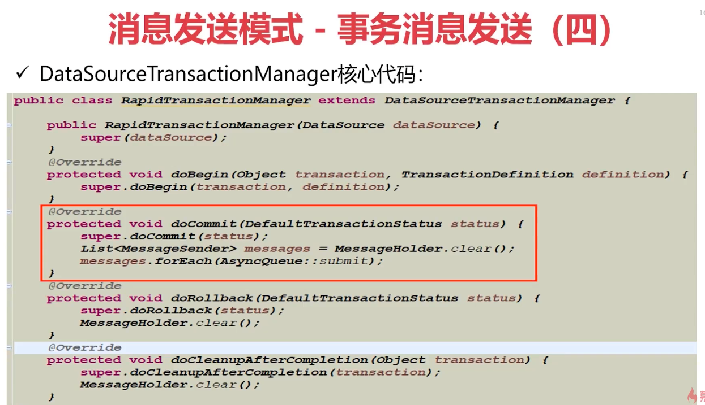

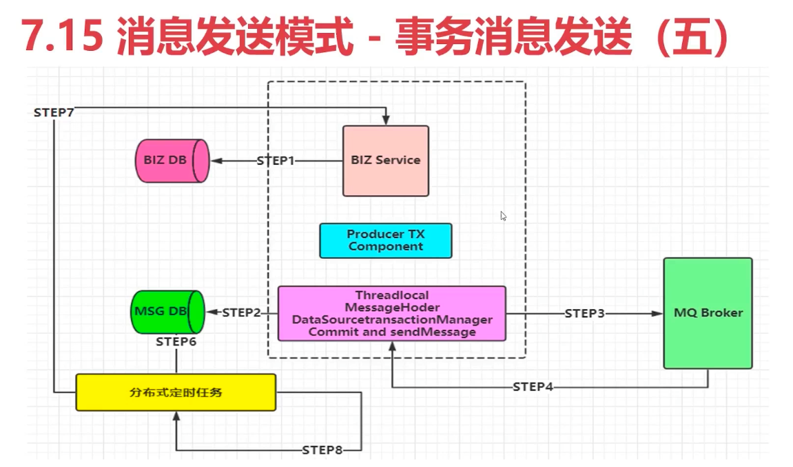

## 7. 消息的幂等性

> 参考：https://www.jianshu.com/p/d8042d7f62e1

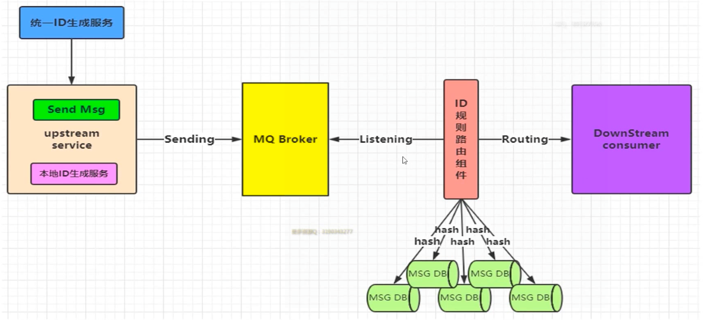

- 这里采用的是唯一索引或数据库主键