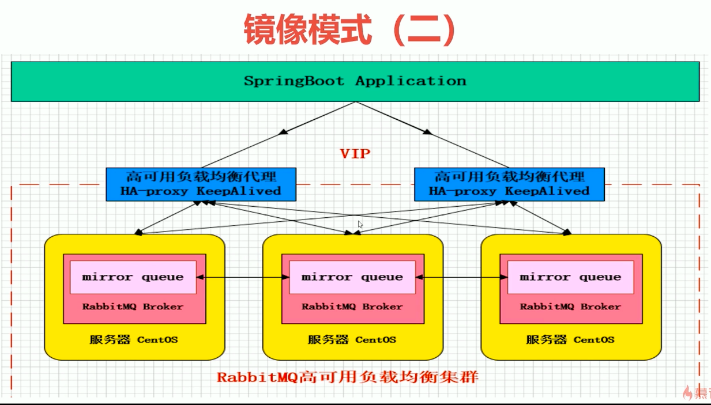

## 1. 安装

```shell
准备：
yum install -y build-essential openssl openssl-devel unixODBC unixODBC-devel make gcc gcc-c++ kernel-devel m4 ncurses-devel tk tc xz tcp_wrappers

下载：
wget www.rabbitmq.com/releases/erlang/erlang-18.3-1.el7.centos.x86_64.rpm
wget http://repo.iotti.biz/CentOS/7/x86_64/socat-1.7.3.2-5.el7.lux.x86_64.rpm
wget www.rabbitmq.com/releases/rabbitmq-server/v3.6.5/rabbitmq-server-3.6.5-1.noarch.rpm

配置文件：
vim /usr/lib/rabbitmq/lib/rabbitmq_server-3.6.5/ebin/rabbit.app
比如修改密码、配置等等，例如：loopback_users 中的 <<"guest">>,只保留guest
服务启动和停止：
启动 rabbitmq-server start &
停止 rabbitmqctl app_stop

rpm -hvi 

管理插件：rabbitmq-plugins enable rabbitmq_management
访问地址：http://192.168.11.76:15672/

```

- rabbitmq有一个默认的用户名和密码，guest和guest,但为了安全考虑，该用户名和密码只允许本地访问，如果是远程操作的话，需要创建新的用户名和密码；

```shell
rabbitmqctl add_user username passwd  //添加用户，后面两个参数分别是用户名和密码
rabbitmqctl set_permissions -p / username ".*" ".*" ".*"  //添加权限
rabbitmqctl set_user_tags username administrator  //修改用户角色,将用户设为管理员

rabbitmqctl add_user root 123456  //添加用户，后面两个参数分别是用户名和密码
rabbitmqctl set_permissions -p / root ".*" ".*" ".*"  //添加权限
rabbitmqctl set_user_tags root administrator  //修改用户角色,将用户设为管理员
```

----------

```
①# hostname 

查看当前主机名

②#hostnamectl set-hostname ***

修改主机名

③#reboot

3.修改hosts文件

①#vi /etc/hosts

最后行加上修改后的IP地址及对应的主机名
我增加的内容：192.168.1.222 node2 
reboot
```


### 1、配置文件相关

> https://www.cnblogs.com/AloneSword/p/4200051.html

## 2. rabbitmq镜像集群


---------------



## 3. 集群搭建

### 1、停止服务

```shell
rabbitmqctl stop
```

### 2、文件同步

PS:选择60、61、62任意一个节点为Master（这里选择60为Master），也就是说我们需要把76的Cookie文件同步到61、62节点上去，进入/var/lib/rabbitmq目录下，把/var/lib/rabbitmq/.erlang.cookie文件的权限修改为777，原来是400；然后把.erlang.cookie文件copy到各个节点下；最后把所有cookie文件权限还原为400即可。	

```shell
chmod .erlang.cookie 777
//进入目录修改权限；远程copy61、62节点，比如：
scp /var/lib/rabbitmq/.erlang.cookie root@192.168.1.61:/var/lib/rabbitmq/
scp /var/lib/rabbitmq/.erlang.cookie root@192.168.1.62:/var/lib/rabbitmq/
到192.168.1.61和192.168.1.62中
```

### 3、组成集群操作

PS:接下来我们就可以使用集群命令，配置60、61、62为集群模式，3个节点（60、61、62）执行启动命令，后续启动集群使用此命令即可。

```shell
rabbitmq-server -detached
```

### 4、slave加入集群操作（重新加入集群也是如此，以最开始的主节点为加入节点）

```shell
//注意做这个步骤的时候：需要配置/etc/hosts 必须相互能够寻址到 --ram 
bhz61：rabbitmqctl stop_app
bhz61：rabbitmqctl join_cluster rabbit@qxh60
bhz61：rabbitmqctl start_app
bhz62：rabbitmqctl stop_app
bhz62：rabbitmqctl join_cluster rabbit@qxh60
bhz62：rabbitmqctl start_app
//在另外其他节点上操作要移除的集群节点
rabbitmqctl forget_cluster_node rabbit@bhz24
```

### 5、 修改集群名称

```shell
rabbitmqctl set_cluster_name rabbitmq_cluster1
```

### 6、查看集群状态

```
rabbitmqctl cluster_status
```

### 7、设置镜像队列策略

```shell
rabbitmqctl set_policy ha-all "^" '{"ha-mode":"all"}'
```

> PS:将所有队列设置为镜像队列，即队列会被复制到各个节点，各个节点状态一致，RabbitMQ高可用集群就已经搭建好了,我们可以重启服务，查看其队列是否在从节点同步。

## 4. 安装Ha-Proxy

### 1、Haproxy简介

HAProxy是一款提供高可用性、负载均衡以及基于TCP和HTTP应用的代理软件，HAProxy是完全免费的、借助HAProxy可以快速并且可靠的提供基于TCP和HTTP应用的代理解决方案。

HAProxy适用于那些负载较大的web站点，这些站点通常又需要会话保持或七层处理。 

HAProxy可以支持数以万计的并发连接,并且HAProxy的运行模式使得它可以很简单安全的整合进架构中，同时可以保护web服务器不被暴露到网络上。

### 2、Haproxy安装

PS:51、52节点同时安装Haproxy，下面步骤统一

```shell
//下载依赖包
yum install -y gcc vim wget
//下载haproxy
wget http://www.haproxy.org/download/1.6/src/haproxy-1.6.5.tar.gz
//解压
tar -zxvf haproxy-1.6.5.tar.gz -C /usr/local
//进入目录、进行编译、安装
cd /usr/local/haproxy-1.6.5
make TARGET=linux31 PREFIX=/usr/local/haproxy
make install PREFIX=/usr/local/haproxy
mkdir /etc/haproxy
//赋权
groupadd -r -g 149 haproxy
useradd -g haproxy -r -s /sbin/nologin -u 149 haproxy
//创建haproxy配置文件
touch /etc/haproxy/haproxy.cfg
```

### 3、Haproxy配置

```shell
#logging options
global
    log 127.0.0.1 local0 info
    maxconn 5120
    chroot /usr/local/haproxy
    uid 99
    gid 99
    daemon
    quiet
    nbproc 20
    pidfile /var/run/haproxy.pid

defaults
    log global
    #使用4层代理模式，”mode http”为7层代理模式
    mode tcp
    #if you set mode to tcp,then you nust change tcplog into httplog
    option tcplog
    option dontlognull
    retries 3
    option redispatch
    maxconn 2000
    contimeout 5s
    ##客户端空闲超时时间为 60秒 则HA 发起重连机制
    clitimeout 60s
    ##服务器端链接超时时间为 15秒 则HA 发起重连机制
    srvtimeout 15s	

listen rabbitmq_cluster
    bind 0.0.0.0:5672
    #配置TCP模式
    mode tcp
    #balance url_param userid
    #balance url_param session_id check_post 64
    #balance hdr(User-Agent)
    #balance hdr(host)
    #balance hdr(Host) use_domain_only
    #balance rdp-cookie
    #balance leastconn
    #balance source //ip
    #简单的轮询
    balance roundrobin
		#rabbitmq集群节点配置 #inter 每隔五秒对mq集群做健康检查， 2次正确证明服务器可用，2次失败证明服务器不可用，并且配置主备机制
    server qxh60 192.168.1.60:5672 check inter 5000 rise 2 fall 2
    server qxh61 192.168.1.61:5672 check inter 5000 rise 2 fall 2
    server qxh62 192.168.1.62:5672 check inter 5000 rise 2 fall 2
#配置haproxy web监控，查看统计信息
listen stats
    bind 192.168.1.52:8100
    mode http
    option httplog
    stats enable
    #设置haproxy监控地址为http://localhost:8100/rabbitmq-stats
    stats uri /rabbitmq-stats
    stats refresh 5s
```

### 4、启动haproxy

```shell
/usr/local/haproxy/sbin/haproxy -f /etc/haproxy/haproxy.cfg
//查看haproxy进程状态
ps -ef | grep haproxy
```

### 5、访问haproxy

> http://192.168.1.51:8100/rabbitmq-stats

## 5. keepalived配置

### 1.keepalived 配置

- master

```
! Configuration File for keepalived

global_defs {
   router_id qxh51  ##标识节点的字符串，通常为hostname

}

vrrp_script chk_haproxy {
    script "/etc/keepalived/haproxy_check.sh"  ##执行脚本位置
    interval 2  ##检测时间间隔
    weight -20  ##如果条件成立则权重减20
}

vrrp_instance VI_1 {
    state MASTER  ## 主节点为MASTER，备份节点为BACKUP
    interface enp0s3 ## 绑定虚拟IP的网络接口（网卡），与本机IP地址所在的网络接口相同（我这里是eth0）
    virtual_router_id 151  ## 虚拟路由ID号（主备节点一定要相同）
    mcast_src_ip 192.168.1.51 ## 本机ip地址
    priority 100  ##优先级配置（0-254的值）
    nopreempt
    advert_int 1  ## 组播信息发送间隔，俩个节点必须配置一致，默认1s
		authentication {  ## 认证匹配
        auth_type PASS
        auth_pass qxh
    }

    track_script {
        chk_haproxy
    }

    virtual_ipaddress {
        192.168.11.151  ## 虚拟ip，可以指定多个
    }
}
```

- Backup

```
! Configuration File for keepalived

global_defs {
   router_id qxh52  ##标识节点的字符串，通常为hostname

}

vrrp_script chk_haproxy {
    script "/etc/keepalived/haproxy_check.sh"  ##执行脚本位置
    interval 2  ##检测时间间隔
    weight -20  ##如果条件成立则权重减20
}

vrrp_instance VI_1 {
    state BACKUP  ## 主节点为MASTER，备份节点为BACKUP
    interface enp0s3 ## 绑定虚拟IP的网络接口（网卡），与本机IP地址所在的网络接口相同
    virtual_router_id 151  ## 虚拟路由ID号（主备节点一定要相同）
    mcast_src_ip 192.168.1.52  ## 本机ip地址
    priority 90  ##优先级配置（0-254的值）
    nopreempt
    advert_int 1  ## 组播信息发送间隔，俩个节点必须配置一致，默认1s
		authentication {  ## 认证匹配
        auth_type PASS
        auth_pass qxh
    }

    track_script {
        chk_haproxy
    }

    virtual_ipaddress {
        192.168.1.151  ## 虚拟ip，可以指定多个
    }
}
```

### 2. 检测脚本

```shell
#!/bin/bash
COUNT=`ps -C haproxy --no-header |wc -l`
if [ $COUNT -eq 0 ];then
    /usr/local/haproxy/sbin/haproxy -f /etc/haproxy/haproxy.cfg
    sleep 2
    if [ `ps -C haproxy --no-header |wc -l` -eq 0 ];then
        killall keepalived
    fi
fi
```

### 3. 执行脚本赋权限

```shell
chmod +x /etc/keepalived/haproxy_check.sh
```

### 4.启动keepalived

```shell
//启动两台机器的keepalived
service keepalived start | stop | status | restart
//查看状态
ps -ef | grep haproxy
ps -ef | grep keepalived
```

