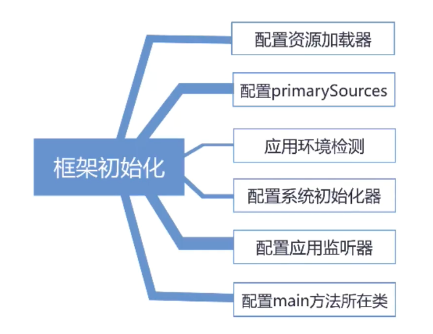
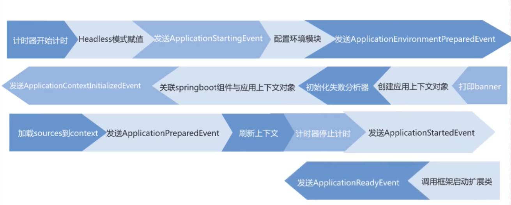
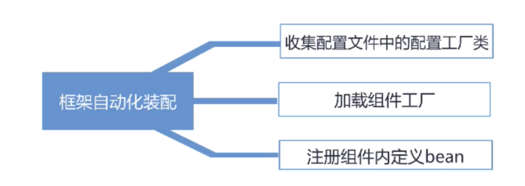
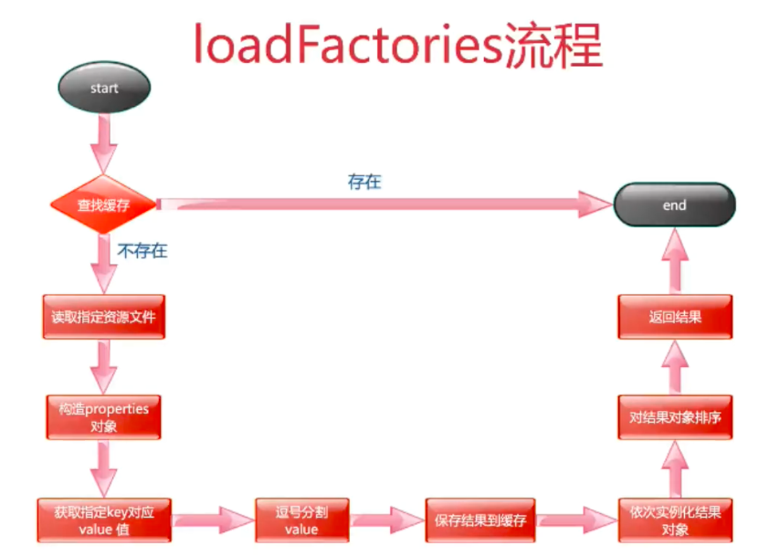

```shell script
# 1. 框架初始化
# 2. 框架启动
# 3. 自动化装配
```

## 1.

- 框架初始化



- 框架启动步骤



- 自动化装配步骤



## 2. springboot初始化器

```shell script
# 1. springboot初始化器介绍
# 2. SpringFactoriesLoader介绍
# 3. 系统初始化器原理解析
# 4. 总结
```

- 介绍

```shell script
# 参考博客： https://www.cnblogs.com/hello-shf/p/10987360.html
# ApplicationContextAware
# https://www.jianshu.com/p/4c0723615a52
# SpringFactoriesLoader
# https://www.cnblogs.com/markLogZhu/p/12496444.html
```

- error

```text
Sources must not be empty
https://blog.csdn.net/com_it/article/details/96733848
```

-

```shell script
# 1. 类名 ApplicationContextInitializer
# 2. spring容器刷新前执行的一个回调函数
# 3. 作用向springboot容器中注册属性
# 4. 使用：继承接口自定义实现
```

- tips

```
# 1. 都要实现ApplicationContextInitializer接口
# 2. Order值越小越先执行
# 3. application.properties中定义的优先于其它方式
```



```text
1. 介绍下springFactoriesLoader
2. springFactoriesLoader如何加载工厂类
3. 系统初始化器的作用
4. 系统初始化器的调用时机 
5. 如何自定义实现系统初始化器
6. 自定义系统初始化器有哪些注意事项

```

## 3. springboot监听器

- 监听器模式要素

```text
1. 事件
2. 监听器
3. 广播器
4. 触发机制
```

- tips

```text
1. 实现ApplicationListener针对单一事件监听
2. 实现 SmartApplicationListener 针对多事件监听
3. 其余和初始化器类似
```

- q

```text
1. 介绍下监听器模式
2. springboot关于监听器的实现有哪些
3. springboot框架有哪些事件以及他们得到顺序
4. 介绍下监听器触发机制
5. 如何自定义实现监听器以及注意事项
6. 实现ApplicationListener和SmartApplicationListener的区别
```

## 4. bean

```text
IOC思想
https://www.cnblogs.com/ma-yuanhao/p/9879782.html
```

- xml配置方式

```text
1. 无参构造
    - contextConfigration
2. 有参构造
3. 静态工厂方法
4. 实例工厂方法
```

- 注解

```text
1. @Component
2. 配置类中使用@Bean
3. 事项factoryBean
4. 实现BeanDefinitionRegistryPostProcessor
    https://www.jianshu.com/p/b4bec64ada70
5. 实现ImportBeanDefinitionRegistrar
    https://blog.csdn.net/jiachunchun/article/details/94569246

# ApplicationContextAware
https://www.cnblogs.com/loong-hon/p/10917755.html       

```

- refresh

```text
https://www.jianshu.com/p/577906fa2cc2
子方法
https://blog.csdn.net/weishuai528/article/details/96460908
- refresh
org/springframework/context/support/AbstractApplicationContext.java

prepareRefresh
    1. 容器状态设置
    
    2. 初始化属性设置
    
    3. 检查必备属性是否存在

obtainFreshBeanFactory
    1. 设置beanFactory的序列化id
    2. 获取beanFactory

prepareBeanFactory
    1. 设置beanfactory的一些属性
    2. 添加后置处理器
    3. 设置忽略的自动装配接口
    4. 注册一些组件

postProcessBeanFactory
    1. 通过被子类重写进行进一步的设置

invokeBeanFactoryPostProcessors
    1. 向容器内添加bean的定义
    2. 容器内bean的定义添加属性 

registerBeanPostProcessors
    1. 找到BeanPostProcessors的实现
    2. 排序后注册进入容器内

initMessageSource
    1. 初始化国际化相关属性

initApplicationEventMulticaster
    1. 初始化事件广播器

onRefresh
    1. 创建web容器

registerListeners
    1. 添加容器内事件到事件广播器
    2. 派发早期事件

finishBeanFactoryInitialization
    1.初始化所有剩下的单实例bean

finishRefresh
    1. 初始化生命周期处理器
    2. 调用生命周期处理器onRefresh方法
    3. 发布ContextRefreshedEvent事件
    4. jmx 
```

- BeanDefinition 和 RootBeanDefinition
```text
https://blog.csdn.net/f641385712/article/details/88041409
```

```text
1. 介绍下IOC思想
2. springboot中bean有哪几种配置方式
3. bean的配置你喜欢那种
4. 介绍下refresh方法流程
5. 介绍一下refresh中你比较熟悉的方法
6. 介绍下bean的实例化流程
```

## 5. bean

```text
1. banner.txt
2. #spring.banner.location=faverate_banner.txt
3.   #spring.banner.image.location=favorite.jpg
4. banner.jpg
5. spring.main.banner-mode=off
6. springApplication.setBanner()
```

- 文本输出

```
    1. 可以通过spring.banner.charset指定字符集
    2. 获取文本内容
    3. 替换占位符
    4. 输出占位符
```

- 图片输出

```text
    1. 可以通过spring.banner.image.*设置图片属性
    2. 读取图片文件流
    3. 输出图片内容
```

- 问题

```
    1. 举例banner常见的获取方式
    2. 简述下框架内banner打印流程
    3. 说明下banner获取原理
    4. 说明下banner输出原理
    5. 说出你熟悉的banner属性有哪些
```

## 6. 启动加载器解析

1. StopWatch

- 启动加载器1

```text
1. 实现CommandLineRunner
2. 重写run
3. 通过order来指定顺序
```

- 启动加载器2

```text
1. 实现 ApplicationRunner
2. 重写run
3. 通过order来指定顺序
```

> 相同级别的ApplicationRunner优先于CommandLineRunner

- 问题

```text
1. Springboot计时器的实现？它有哪些优点
2. 让你去设计实现一个计时器，你的思路
3. 怎么实现在springboot启动后执行程序
4. 启动加载器如何实现
5. 启动加载器的实现由什么异同点
6. 启动加载器的调用时机
```