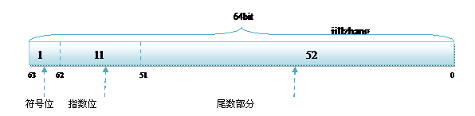
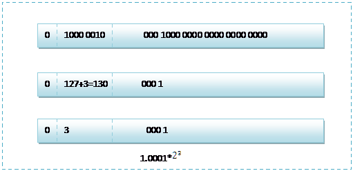

## 1. 浮点数在计算中的存储方式

`C`语言和`C#`语言中，对于浮点类型的数据采用单精度类型`(float)`和双精度类型`(double)`来存储，`float`数据占用`32bit,double`数据占用`64bit`,我们在声明一个变量`float f= 2.25f`的时候，是如何分配内存的呢？如果胡乱分配，那世界岂不是乱套了么，其实不论是`float`还是`double`在存储方式上都是遵从IEEE的规范的，float遵从的是`IEEE R32.24` ,而`double` 遵从的是`R64.53`。

  无论是单精度还是双精度在存储中都分为三个部分：

1. 符号位(Sign) : 0代表正，1代表为负
2. 指数位（Exponent）:用于存储科学计数法中的指数数据，并且采用移位存储
3. 尾数部分（Mantissa）：尾数部分

 其中float的存储方式如下图所示：

而双精度的存储方式为:

R32.24和R64.53的存储方式都是用科学计数法来存储数据的，比如8.25用十进制的科学计数法表示就为:
$$
8.25*10^1
$$

而120.5可以表示为:
$$
1.25*10^2
$$

这些小学的知识就不用多说了吧。而我们傻蛋计算机根本不认识十进制的数据，他只认识0，1，所以在计算机存储中，首先要将上面的数更改为二进制的科学计数法表示，8.25用二进制表示可表示为100.01,我靠，不会连这都不会转换吧?那我估计要没辙了。那么8.25的科学表示为：

$$
1.0001*2^2
$$

**第一位都是1嘛，干嘛还要表示呀？可以将小数点前面的1省略，所以23bit的尾数部分，可以表示的精度却变成了24bit**，道理就是在这里，**那24bit能精确到小数点后几位呢，我们知道9的二进制表示为1001，所以4bit能精确十进制中的1位小数点，24bit就能使float能精确到小数点后6位**，而对于指数部分，因为指数可正可负，8位的指数位能表示的指数范围就应该为:-127-128了，所以指数部分的存储采用移位存储，存储的数据为元数据+127，下面就看看8.25和120.5在内存中真正的存储方式。

首先看下8.25，用二进制的科学计数法表示为:
$$
8.25*10^1
$$

按照上面的存储方式，符号位为:0，表示为正，指数位为:3+127=130 ,位数部分为,故8.25的存储方式如下图所示:

